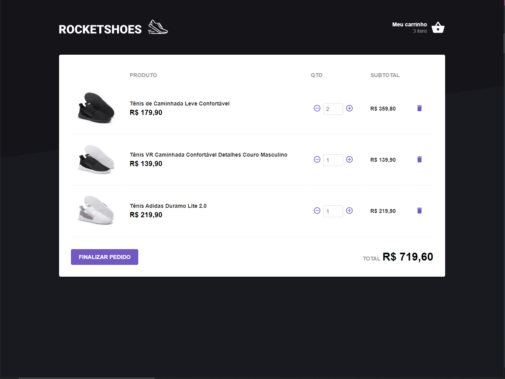
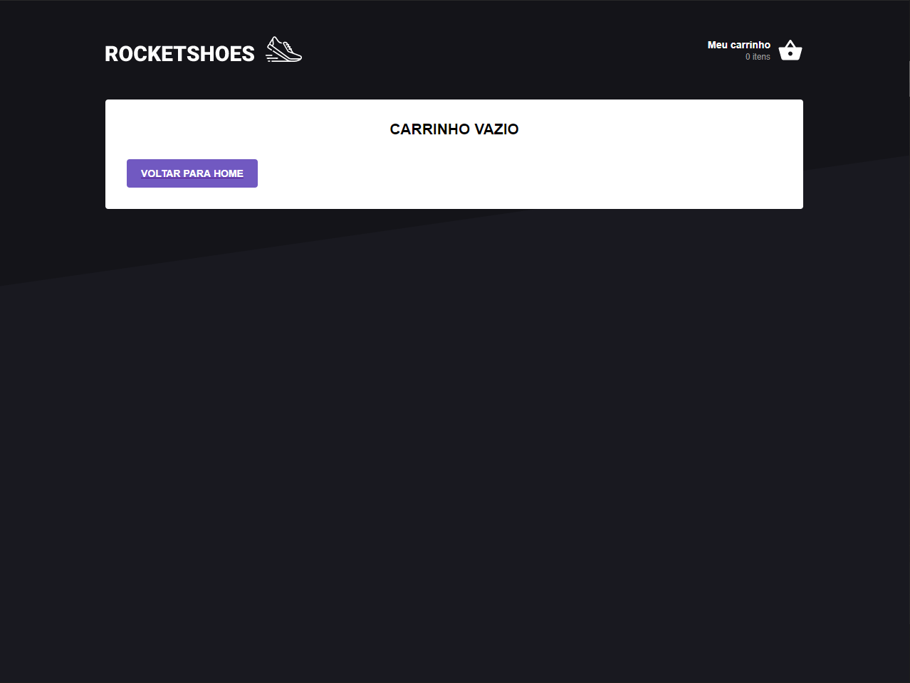

<h1 align="center">
    Rocketshoes (WEB)
</h1>

 

## 💻 Projeto

Rocketshoes (WEB) é aplicação feita utilizando ReactJS, que implementa o fluxo de carrinho de compras de um e-commerce.

## :camera: Demonstração

  

## :rocket: Tecnologias

Esse projeto foi desenvolvido com as seguintes tecnologias:

✔️React

✔️Arquitetura Flux

✔️Redux

✔️Redux Saga

✔️Styled Components

✔️Axios

✔️Json-server

✔️Reactotron

✔️React-Toastify

## ⚙ Configuração

1- Para instalar as dependências:
> yarn

2- Para iniciar o json-server:
> yarn server

3- Para iniciar a aplicação:
> yarn start

---

